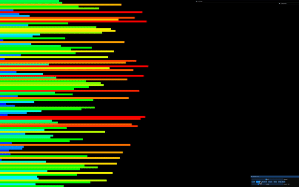

## Sort_Optimizer


## 🧠 Project Overview

`Push Swap` is an algorithmic project where the goal is to sort a stack of integers using a 
limited set of operations and the least number of moves possible. This project focuses on algorithm optimization and data structure manipulation 
(mainly stacks and linked lists).

## 🧱 Objective

- Take an unsorted list of integers.
- Sort the list using two stacks (`stack a` and `stack b`) and a limited set of
 operations:
  - `sa`, `sb`, `ss` – swap
  - `pa`, `pb` – push
  - `ra`, `rb`, `rr` – rotate
  - `rra`, `rrb`, `rrr` – reverse rotate
- Optimize the number of operations to achieve sorting in the fewest moves possible.

## 📚 Key Concepts

- Data structures: linked lists, stacks
- Algorithm optimization
- Sorting algorithms (e.g., radix sort, insertion sort)
- Memory management in C
- Writing efficient, clean, and testable C code

## Turk Algorithm

⚙️ Sorting Strategy – Turk Algorithm (42 Approach)

One of the popular strategies used in the push_swap project is often referred to as the Turk algorithm, a nickname within the 42 community. It is not an official algorithm but rather a custom, optimized method developed by students to achieve minimal operations by analyzing the most efficient way to push and sort numbers between two stacks (a and b).
🧠 Key Ideas:

    Identify the best candidate in stack b to move to its correct 
    position in stack a with the fewest operations.

    Calculate and compare the cost (number of moves) for each 
    element in stack b.

    Use combined rotations (rr, rrr) to optimize movement.

    Push back to stack a in the most efficient order.

This approach heavily emphasizes minimizing the total number of 
operations and is typically used after splitting the initial data
 set using strategies like chunking or radix sorting.

## 🛠️ Technologies

- Language: C


## 📸 Example

```shell
$ ./push_swap 3 2 1
pb
pb
sa
pa
pa
```